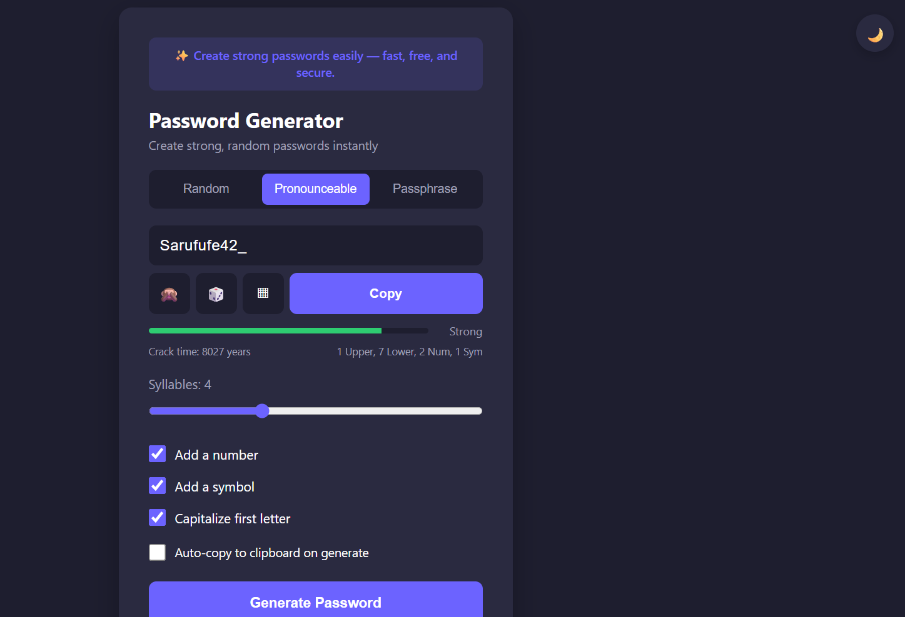

# 🔐 Password Generator

A modern, secure, and responsive Password Generator built with **HTML, CSS, and JavaScript**. This application helps users create strong, customizable passwords to improve online security with an intuitive and user-friendly interface.

---

## 🚀 Features

- 🔒 Generate strong and secure passwords instantly
- 📏 Adjustable password length
- 🔤 Include uppercase letters
- 🔡 Include lowercase letters
- 🔢 Include numbers
- 🔣 Include special characters
- 📋 One-click copy to clipboard
- ⚡ Auto-copy option
- 🎨 Clean, modern, and responsive UI
- 📱 Works on desktop, tablet, and mobile devices

---

## 🛠️ Technologies Used

- HTML5
- CSS3
- JavaScript (ES6)

---

## 📂 Project Structure

```
password-generator/
│── index.html
│── style.css
│── script.js
```

---

## 💡 How It Works

1. Select the desired password length.
2. Choose the character types to include.
3. Click **Generate Password**.
4. Copy the generated password using the copy button or enable auto-copy.

---

## 🎯 Project Objectives

- Improve web development skills.
- Practice JavaScript DOM manipulation.
- Create a practical cybersecurity utility.
- Build a responsive and user-friendly application.

---

## 📸 Preview


## 🚀 Live Demo

**GitHub Pages:**
https://pari-26-vaish.github.io/password-generator/

---

## 📈 Future Improvements

- Password strength meter
- Password history
- Dark/Light mode
- Random passphrase generator
- Export password to file
- Multiple language support

---

## 👩‍💻 Author

**Pari Vaish**

- GitHub: https://github.com/pari-26-vaish
- LinkedIn: https://www.linkedin.com/in/pari-vaish-623053354/

---

## ⭐ Support

If you like this project, consider giving it a ⭐ on GitHub.

---

## 📄 License

This project is licensed under the MIT License.
